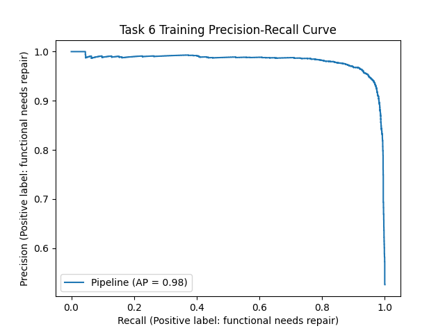

# Data Mining Tanzanian Water Pumps

The aim was to construct and use artificial neural networks to solve a [water-pump classification problem](https://www.worldbank.org/en/news/press-release/2018/03/20/improving-water-supply-and-sanitation-can-help-tanzania-achieve-its-human-development-goals) with [real-world data](https://www.drivendata.org/competitions/7/pump-it-up-data-mining-the-water-table/) from Tanzania. The solution, which predicts the repair status of water pumps, relies on a multi-layer perceptron classifier and entails a logistic regression classifier as a baseline for evaluation purposes. Both were implemented using [sklearn](https://scikit-learn.org/). Different methods to deal with imbalanced data were implemented and evaluated, among them SMOTE-NC using [imbalanced-learn](https://imbalanced-learn.org/).



### Compiling and Running Instructions

**Begin by copying the datasets into the `place-data-here` directory**.

Navigate into the ```pumps``` directory:
```shell script
cd pumps
```

Set up a virtual environment within the directory:
```shell script
python3 -m venv my_env
```

Activate the virtual environment:
```shell script
source my_env/bin/activate
```

Install the requirements to your virtual environment via pip:
```shell script
pip install -r requirements.txt
```

To run via ```main.py```, your command should take the following form:
```shell script
python3 main.py <task_id> <train|test|predict>
```

For example, pass...
```shell script
python3 main.py task1 test
```
...to predict on the task 1 test set.

The output should be:
```shell script
Test set classification accuracy: 0.634
```

### Valid Standard Commands

```shell script
python3 main.py task1 train
python3 main.py task1 test
python3 main.py task1 predict
python3 main.py task2 train
python3 main.py task2 test
python3 main.py task2 predict
python3 main.py task3 train
python3 main.py task3 test
python3 main.py task3 predict
python3 main.py task4 train
python3 main.py task4 test
python3 main.py task4 predict
```


### Self-Contained Scripts

In addition, a number of self-contained scripts can be executed as follows:

```shell script
python3 baseline_task1.py
python3 baseline_task2.py
python3 baseline_task3.py
python3 baseline_task4.py
python3 task1_explore.py
python3 task2_explore.py
python3 task3_explore.py
python3 task6.py
```

### Non-Standard Dependencies
- [imbalanced-learn](https://imbalanced-learn.org/): A library relying on scikit-learn that provides tools for classification with imbalanced classes.
